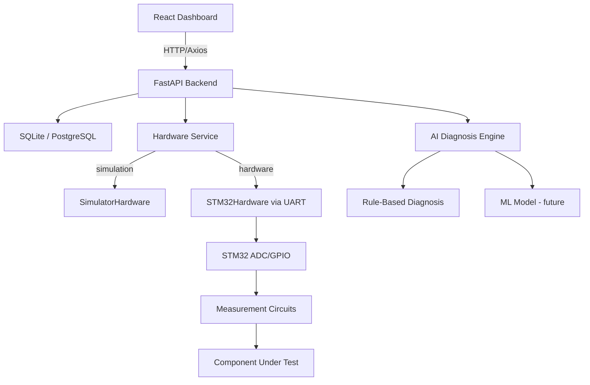

# AI-Driven Electronic Component Intelligence and Diagnostic Platform

Intelligent electronic component testing platform — measures electrical parameters via STM32 hardware (or simulation), processes measurements through a FastAPI backend, performs AI-powered component health/fault diagnosis, and displays everything on a modern animated React dashboard.

---

## Architecture



---

## Features

- Select component → select test → configure → start test
- Real-time measurement polling with animated charts
- AI-powered health score (0–100) and fault detection
- Rule-based diagnosis engine (ML-ready architecture)
- Full test history with search/filter
- Detailed printable test reports
- Simulation mode — runs without physical hardware
- Hardware abstraction layer — swap simulator for real STM32 with one env var

---

## Technology Stack

| Layer | Technology |
|-------|-----------|
| Frontend | React, Vite, Tailwind CSS, Framer Motion, Recharts, Lucide |
| Backend | Python, FastAPI, SQLAlchemy, Pydantic, Uvicorn |
| Database | SQLite (dev), PostgreSQL-ready |
| AI/ML | NumPy, Pandas, Scikit-learn, Rule-based engine |
| Hardware | STM32, UART/USB, ADC, GPIO, Timers |

---

## Supported Components

- Resistor — resistance, voltage, current tests
- Capacitor — capacitance, voltage, ESR tests
- Diode — forward voltage, reverse leakage, I-V curve
- Transistor — Vbe, gain, saturation
- Digital IC — supply voltage, current consumption, logic levels

---

## Hardware Components

- STM32 Development Board (e.g. STM32F103, STM32F4)
- ST-Link Programmer/Debugger
- Voltage & Current Measurement Circuits
- Resistance & Capacitance Measurement Circuits
- Temperature Sensor (e.g. NTC, LM35)
- ADC / Signal Conditioning Circuit
- Relay / MOSFET Switching Circuit
- ZIF / DIP Test Socket
- Regulated Power Supply (3.3V / 5V)
- Precision Resistors & Reference Capacitors
- Protection Components (TVS, fuses)

> ⚠️ This platform is designed for **low-voltage electronics testing only** (≤30V, ≤2A). Always use appropriate protection and isolation on physical hardware.

---

## Project Structure

```
component-intelligence/
├── backend/
│   ├── app/
│   │   ├── main.py              # FastAPI app, startup, routers
│   │   ├── config.py            # Settings from .env
│   │   ├── api/                 # Route handlers
│   │   ├── models/              # SQLAlchemy ORM models
│   │   ├── schemas/             # Pydantic schemas
│   │   ├── services/            # Business logic
│   │   ├── ai/                  # Diagnosis engine + ML architecture
│   │   ├── hardware/            # STM32 + Simulator abstraction
│   │   └── database/            # DB setup + seed data
│   ├── requirements.txt
│   └── .env
└── frontend/
    ├── src/
    │   ├── components/          # Reusable UI components
    │   ├── pages/               # Route pages
    │   ├── services/api.js      # Axios API client
    │   ├── hooks/useTestData.js # Polling hook
    │   ├── utils/formatters.js  # Value formatters
    │   └── App.jsx
    ├── .env
    └── tailwind.config.js
```

---

## Setup

### Backend

```bash
cd backend
python -m venv venv

# Windows
venv\Scripts\activate

pip install -r requirements.txt
uvicorn app.main:app --reload --port 8000
```

API docs available at: http://localhost:8000/docs

### Frontend

```bash
cd frontend
npm install
npm run dev
```

Dashboard available at: http://localhost:5173

---

## Environment Variables

### Backend (`backend/.env`)

```env
DATABASE_URL=sqlite:///./diagnostic.db
HARDWARE_MODE=simulation        # or "hardware"
SERIAL_PORT=                    # e.g. COM3 or /dev/ttyUSB0
CORS_ORIGINS=http://localhost:5173,http://localhost:3000
```

### Frontend (`frontend/.env`)

```env
VITE_API_URL=http://localhost:8000
```

---

## API Endpoints

| Method | Endpoint | Description |
|--------|----------|-------------|
| GET | `/api/system/status` | Hardware + system status |
| GET | `/api/components` | Supported component list |
| POST | `/api/tests` | Create a new test |
| GET | `/api/tests` | List all tests |
| GET | `/api/tests/{id}` | Get test by ID |
| POST | `/api/tests/{id}/start` | Start a test |
| POST | `/api/tests/{id}/measure` | Acquire one measurement |
| GET | `/api/tests/{id}/measurements` | All measurements for test |
| POST | `/api/tests/{id}/diagnose` | Run AI diagnosis |
| GET | `/api/tests/{id}/diagnosis` | Get diagnosis result |
| GET | `/api/tests/{id}/report` | Full test report |
| GET | `/api/history` | Test history with diagnosis |

---

## Simulation Mode

When `HARDWARE_MODE=simulation`, the `SimulatorHardware` class generates realistic measurements:

- Gaussian noise around nominal values
- Sinusoidal drift for realistic chart movement
- ~20% chance of fault injection per test session
- Gradual fault drift over time (not instant)

To switch to real STM32 hardware:
1. Set `HARDWARE_MODE=hardware` in `backend/.env`
2. Set `SERIAL_PORT=COM3` (or your port)
3. Flash the STM32 firmware that reads ADC and sends JSON over UART at 115200 baud

Expected STM32 JSON output format:
```json
{"voltage": 3.301, "current": 0.0331, "resistance": 99.7, "capacitance": null, "temperature": 25.3}
```

---

## AI Diagnosis Engine

### Rule-Based (active)

```
deviation% = |measured - expected| / expected × 100

health_score = 100 - min(deviation% × 2, 80)

≥ 90  → HEALTHY
70-89 → WARNING
< 70  → FAULT
```

### ML Model (architecture ready)

`backend/app/ai/model.py` provides `train()`, `predict()`, `save_model()`, `load_model()` using scikit-learn RandomForestClassifier. Train with real labeled hardware data when available.

---

## Safety

- Voltage validated: max 30V
- Current validated: max 2A
- Temperature warning: > 85°C
- Unsafe configurations rejected before test starts
- Designed for low-voltage bench testing only

---

## Troubleshooting

| Issue | Fix |
|-------|-----|
| CORS error | Check `CORS_ORIGINS` in backend `.env` |
| Backend not starting | Run `pip install -r requirements.txt` |
| Empty dashboard | Backend must be running for seed data to load |
| Hardware not connecting | Check `SERIAL_PORT` and baud rate |
| Charts not updating | Ensure test is in `running` status |
